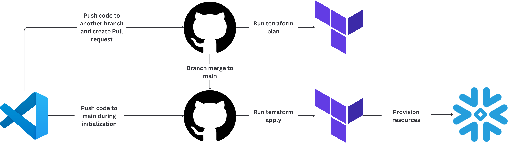
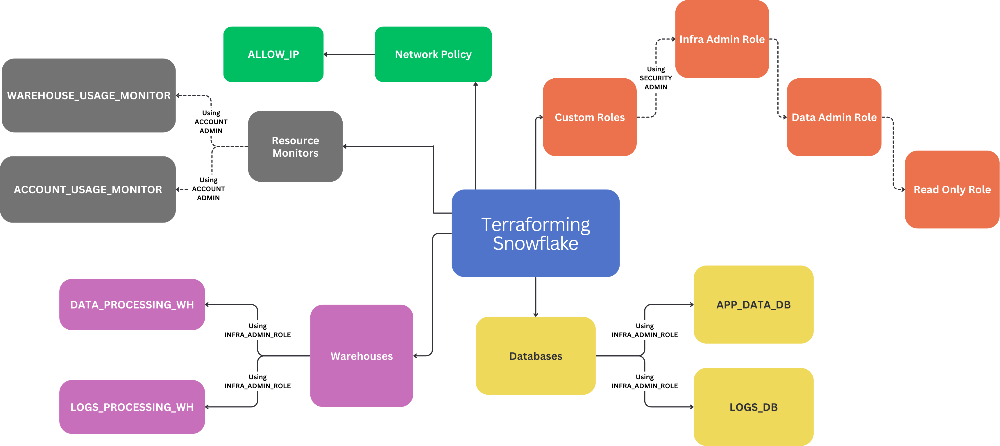

# NICE-VIP-terraform-snowflake-management
This repository provides Terraform configurations and modules for managing Snowflake infrastructure. It includes templates for provisioning, configuring, and automating Snowflake resources such as databases, schemas, and warehouses, ensuring seamless and scalable data management in the cloud.

## Why did we choose Terraform over other IaC tools??
There were a couple of reasons. The first was that Snowflake-Labs itself maintains the Terraform plugin for Snowflake, enabling quicker support for new features. Terraform also has the largest community out of all other IaC tools and has a detailed documentation. The Hashicorp Configuration Language (HCL), used by Terraform, provides a great way to describe and write cloud infrastructure.

## Snowflake Overview
Snowflake is a cloud-based data platform that provides scalable storage, compute, and analytics. It follows a multi-cluster shared data architecture, enabling efficient data management and access control.

- Objects in Snowflake
Snowflake organizes data using objects like databases, schemas, tables, views, stages, warehouses, and more. These objects help structure and manage data efficiently.

- Users and Roles
Users in Snowflake are assigned roles that control their access. Instead of granting permissions directly to users, Role-Based Access Control (RBAC) is used to assign privileges through roles.

- Access Control: DAC & RBAC \
Discretionary Access Control (DAC): Object owners control access by granting privileges. \
Role-Based Access Control (RBAC): Access is assigned based on roles, ensuring security and scalability.

- System-Defined Roles
Snowflake provides predefined roles to simplify access control: \
ACCOUNTADMIN – Full control, including billing and security. \
SYSADMIN – Manages databases, schemas, and warehouses. \
SECURITYADMIN – Controls roles and privileges. \
USERADMIN – Manages users but not privileges. \
PUBLIC – Default role with minimal access.

## Workflow Diagram

## Architecture Diagram

